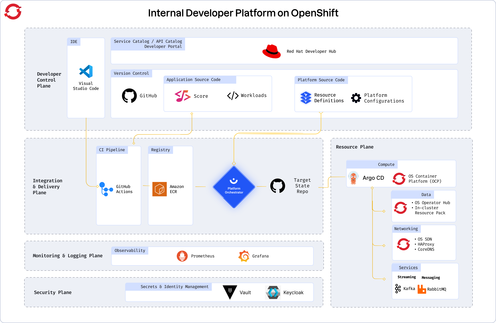

# Humanitec Red Hat OpenShift Reference Architecture

> TL;DR
>
> Skip the theory? Go [here](README.md#how-to-spin-up-your-humanitec-red-hat-openshift-reference-architecture) to spin up your Humanitec Red Hat OpenShift Reference Architecture Implementation.
>
> [Follow this learning path to master your Internal Developer Platform](https://developer.humanitec.com/training/master-your-internal-developer-platform/introduction/).
>

Building an Internal Developer Platform (IDP) can come with many challenges. To give you a head start, we’ve created a set of [reference architectures](https://humanitec.com/reference-architectures) based on hundreds of real-world setups. These architectures described in code provide a starting point to build your own IDP within minutes, along with customization capabilities to ensure your platform meets the unique needs of your users (developers).

The initial version of this reference architecture has been presented by Mike Gatto, Sr. DevOps Engineer, McKinsey and Stephan Schneider, Digital Expert Associate Partner, McKinsey at [PlartformCon 2023](https://www.youtube.com/watch?v=AimSwK8Mw-U).

## What is an Internal Developer Platform (IDP)?

An [Internal Developer Platform (IDP)](https://humanitec.com/blog/what-is-an-internal-developer-platform) is the sum of all the tech and tools that a platform engineering team binds together to pave golden paths for developers. IDPs lower cognitive load across the engineering organization and enable developer self-service, without abstracting away context from developers or making the underlying tech inaccessible. Well-designed IDPs follow a Platform as a Product approach, where a platform team builds, maintains, and continuously improves the IDP, following product management principles and best practices.

## Understanding the different planes of the IDP reference architecture

When McKinsey originally [published the reference architecture](https://www.youtube.com/watch?v=AimSwK8Mw-U) they proposed five planes that describe the different parts of a modern Internal Developer Platform (IDP).



### Developer Control Plane

This plane is the primary configuration layer and interaction point for the platform users. It harbors the following components:

* A **Version Control System**. GitHub is a prominent example, but this can be any system that contains two types of repositories:
  * Application Source Code
  * Platform Source Code, e.g. using Terraform
* **Workload specifications**. The reference architecture uses [Score](https://developer.humanitec.com/score/overview/).
* A **portal** for developers to interact with. It can be the Humanitec Portal, but you might also use [Backstage](https://backstage.io/) or any other portal on the market.

### Integration and Delivery Plane

This plane is about building and storing the image, creating app and infra configs from the abstractions provided by the developers, and deploying the final state. It’s where the domains of developers and platform engineers meet.

This plane usually contains four different tools:

* A **CI pipeline**. It can be Github Actions or any CI tooling on the market.
* The **image registry** holding your container images. Again, this can be any registry on the market.
* An **orchestrator** which in our example, is the Humanitec Platform Orchestrator.
* The **CD system**, which can be the Platform Orchestrator’s deployment pipeline capabilities — an external system triggered by the Orchestrator using a webhook, or a setup in tandem with GitOps operators like ArgoCD.

### Monitoring and Logging Plane

The integration of monitoring and logging systems varies greatly depending on the system. This plane however is not a focus of the reference architecture.

### Security Plane

The security plane of the reference architecture is focused on the secrets management system. The secrets manager stores configuration information such as database passwords, API keys, or TLS certificates needed by an Application at runtime. It allows the Platform Orchestrator to reference the secrets and inject them into the Workloads dynamically. You can learn more about secrets management and integration with other secrets management [here](https://developer.humanitec.com/platform-orchestrator/security/overview).

The reference architecture sample implementations use the secrets store attached to the Humanitec SaaS system.

### Resource Plane

This plane is where the actual infrastructure exists including clusters, databases, storage, or DNS services. The configuration of the Resources is managed by the Platform Orchestrator which dynamically creates app and infrastructure configurations with every deployment and creates, updates, or deletes dependent Resources as required.

## How to spin up your Humanitec Red Hat OpenShift Reference Architecture

This repo contains an implementation of part of the Humanitec Reference Architecture for an Internal Developer Platform, including two different Portal solutions: Red Hat Developer Hub and Backstage.

By default, the following will be provisioned:

* Resource Definitions in Humanitec for:
  * Kubernetes Cluster
* AWS IAM objects for using the Elastic Container Registry (ECR) and AWS Secrets Manager

### Prerequisites

* A Humanitec account with the `Administrator` role in an Organization. Get a [free trial](https://humanitec.com/free-trial?utm_source=github&utm_medium=referral&utm_campaign=aws_refarch_repo) if you are just starting.
* A Red Hat OpenShift cluster
* An AWS account
* [AWS CLI](https://aws.amazon.com/cli/) installed locally
* [OpenShift CLI](https://docs.openshift.com/container-platform/4.15/cli_reference/openshift_cli/getting-started-cli.html) installed locally
* [terraform](https://www.terraform.io/) installed locally

The OpenShift Reference Architecture does not make any assumptions where your OpenShift platform runs. The cluster API server has to be publicly accessible.

The Reference Architecture uses [AWS ECR](https://docs.aws.amazon.com/AmazonECR/latest/userguide/what-is-ecr.html) to store container images and [AWS Secrets Manager](https://docs.aws.amazon.com/secretsmanager/latest/userguide/intro.html) to store secrets and therefore requires an AWS account.

### Usage

**Note: Using this Reference Architecture Implementation will incur costs for your infrastructure.**

It is recommended that you fully review the code before you run it to ensure you understand the impact of provisioning this infrastructure.
Humanitec does not take responsibility for any costs incurred or damage caused when using the Reference Architecture Implementation.

This reference architecture implementation uses Terraform. You will need to do the following:

1. [Fork this GitHub repo](https://github.com/humanitec-architecture/reference-architecture-rhos/fork), clone it to your local machine and navigate to the root of the repository.

2. Set the required input variables. (see [Required input variables](#required-input-variables))

3. Ensure you are logged in with `aws`. (Follow the [quickstart](https://docs.aws.amazon.com/cli/latest/userguide/getting-started-quickstart.html) if you aren't)

4. Ensure you are logged in with `oc`. (Follow [Logging in to the OpenShift CLI using a web browser](https://docs.openshift.com/container-platform/4.15/cli_reference/openshift_cli/getting-started-cli.html#cli-logging-in-web_cli-developer-commands) if you aren't)

5. Set the `HUMANITEC_TOKEN` environment variable to an appropriate Humanitec API token with the `Administrator` role on the Humanitec Organization.

   For example:

   ```shell
   export HUMANITEC_TOKEN="my-humanitec-api-token"
   ```

6. Run terraform:

   ```shell
   terraform init
   terraform plan
   terraform apply
   ```

#### Required input variables

Terraform reads variables by default from a file called `terraform.tfvars`. You can create your own file by renaming the `terraform.tfvars.example` file in the root of the repo and then filling in the missing values.

You can see find a details about each of those variables and additional supported variables under [Inputs](#inputs).

### Verify your result

Check for the existence of key elements of the reference architecture. This is a subset of all elements only. For a complete list of what was installed, review the Terraform code.

1. Set the `HUMANITEC_ORG` environment variable to the ID of your Humanitec Organization (must be all lowercase):

   ```shell
   export HUMANITEC_ORG="my-humanitec-org"
   ```

2. Verify the existence of the Resource Definition for the OpenShift cluster in your Humanitec Organization:

   ```shell
   curl -s https://api.humanitec.io/orgs/${HUMANITEC_ORG}/resources/defs/ref-arch \
     --header "Authorization: Bearer ${HUMANITEC_TOKEN}" \
     | jq .id,.type
   ```

   This should output:

   ```shell
   "ref-arch"
   "k8s-cluster"
   ```
  
3. Verify the existence of the Humanitec K8s Service Account:

   ```shell
   kubectl -n humanitec-system get serviceaccounts humanitec
   ```

   This should output:

   ```shell
   NAME        SECRETS   AGE
   humanitec   1         <>
   ```

### Enable a portal (optional)

#### Portal Prerequisites

Both portal solutions require a GitHub connection, which in turn needs:

* A GitHub organization and permission to create new repositories in it. Go to <https://github.com/account/organizations/new> to create a new org (the "Free" option is fine). Note: is has to be an organization, a free account is not sufficient.
* Create a classic github personal access token with `repo`, `workflow`, `delete_repo` and `admin:org` scope [here](https://github.com/settings/tokens).
* Set the `GITHUB_TOKEN` environment variable to your token.

  ```shell
  export GITHUB_TOKEN="my-github-token"
  ```

* Set the `GITHUB_ORG_ID` environment variable to your GitHub organization ID.

  ```shell
  export GITHUB_ORG_ID="my-github-org-id"
  ```

* Install the GitHub App for Backstage into your GitHub organization
  * Run `docker run --rm -it -e GITHUB_ORG_ID -v $(pwd):/pwd -p 127.0.0.1:3000:3000 ghcr.io/humanitec-architecture/create-gh-app` ([image source](https://github.com/humanitec-architecture/create-gh-app/)) and follow the instructions:
    * “All repositories” ~> Install
    * “Okay, […] was installed on the […] account.” ~> You can close the window and server.

#### Portal Usage

* Enable `with_backstage` or `with_rhdh` inside your `terraform.tfvars` and configure the additional variables that a required for Backstage and RHDH.
* Perform another `terraform apply`

#### Verify portal setup

##### Backstage

* [Fetch the DNS entry](https://developer.humanitec.com/score/getting-started/get-dns/) of the Humanitec Application `backstage`, Environment `development`.
* Open the host in your browser.
* Click the "Create" button and scaffold your first application.

##### Red Hat Developer Hub

* Get the host of your Developer Hub instance via `kubectl -n rhdh get routes`
* Open the host in your browser.
* Click the "Create" button and scaffold your first application.

### Enable ArgoCD (optional)

#### ArgoCD Prerequisites

ArgoCD requires a GitHub connection, which in turn needs:

* A GitHub organization and permission to create new repositories in it. Go to <https://github.com/account/organizations/new> to create a new org (the "Free" option is fine). Note: is has to be an organization, a free account is not sufficient.
* Create a classic github personal access token with `repo`, `workflow`, `delete_repo` and `admin:org` scope [here](https://github.com/settings/tokens).
* Set the `GITHUB_TOKEN` environment variable to your token.

  ```shell
  export GITHUB_TOKEN="my-github-token"
  ```

* Set the `GITHUB_ORG_ID` environment variable to your GitHub organization ID.

  ```shell
  export GITHUB_ORG_ID="my-github-org-id"
  ```

#### ArgoCD Usage

* Enable `with_argocd` inside your `terraform.tfvars` and configure the additional variables that a required for ArgoCD.
* Perform another `terraform apply`

#### Verify ArgoCD setup

* Run `kubectl -n argocd get routes`
* Open the host in your browser.
* Select "Log In Via OpenShift"
* Deploy a Humanitec Application and within a minute you should see a new Application in ArgoCD being synced.

### Cleaning up

Once you are finished with the reference architecture, you can remove all provisioned infrastructure and the resource definitions created in Humanitec with the following steps:

1. Delete all Humanitec Applications scaffolded using the Portal, if you used one, but not the `backstage` app itself.

2. Ensure you are (still) logged in with `aws`.

3. Ensure you still have the `HUMANITEC_TOKEN` environment variable set to an appropriate Humanitec API token with the `Administrator` role on the Humanitec Organization.

4. Run terraform:

   ```shell
   terraform destroy
   ```

<!-- BEGIN_TF_DOCS -->
### Requirements

| Name | Version |
|------|---------|
| terraform | >= 1.0.0 |
| terraform | >= 1.3.0 |
| aws | ~> 5.17 |
| github | ~> 5.38 |
| helm | ~> 2.13 |
| humanitec | ~> 1.0 |
| kubectl | ~> 2.0 |
| kubernetes | ~> 2.30 |
| random | ~> 3.5 |
| time | ~> 0.11 |
| tls | ~> 4.0 |

### Providers

| Name | Version |
|------|---------|
| humanitec | ~> 1.0 |

### Modules

| Name | Source | Version |
|------|--------|---------|
| base | ./modules/base | n/a |
| cd\_argocd | ./modules/cd-argocd | n/a |
| github | github.com/humanitec-architecture/reference-architecture-aws | v2024-06-11//modules/github |
| github\_app | github.com/humanitec-architecture/shared-terraform-modules | v2024-06-10//modules/github-app |
| humanitec\_k8s\_connection | ./modules/humanitec-k8s-connection | n/a |
| portal\_backstage | ./modules/portal-backstage | n/a |
| portal\_rhdh | ./modules/portal-rhdh | n/a |
| terraform\_state\_backend | cloudposse/tfstate-backend/aws | 1.1.1 |

### Resources

| Name | Type |
|------|------|
| [humanitec_service_user_token.deployer](https://registry.terraform.io/providers/humanitec/humanitec/latest/docs/resources/service_user_token) | resource |
| [humanitec_user.deployer](https://registry.terraform.io/providers/humanitec/humanitec/latest/docs/resources/user) | resource |

### Inputs

| Name | Description | Type | Default | Required |
|------|-------------|------|---------|:--------:|
| apiserver | The API server URL of your OpenShift cluster | `string` | n/a | yes |
| aws\_account\_id | AWS Account (ID) to use | `string` | n/a | yes |
| aws\_region | AWS region | `string` | n/a | yes |
| basedomain | Base domain | `string` | n/a | yes |
| kubeconfig | Path to your kubeconfig file | `string` | n/a | yes |
| kubectx | The context to use from your kubeconfig to connect Terraform providers to the cluster | `string` | n/a | yes |
| environment | Environment | `string` | `"development"` | no |
| github\_manifests\_password | GitHub password  to pull & push manifests (required for ArgoCD) | `string` | `null` | no |
| github\_manifests\_repo | GitHub repository for manifests (required for ArgoCD) | `string` | `"humanitec-app-manifests"` | no |
| github\_manifests\_username | GitHub username to pull & push manifests (required for ArgoCD) | `string` | `null` | no |
| github\_org\_id | GitHub org id (required for Backstage and RHDH) | `string` | `null` | no |
| humanitec\_org\_id | Humanitec Organization ID | `string` | `null` | no |
| with\_argocd | Deploy ArgoCD | `bool` | `false` | no |
| with\_backstage | Deploy Backstage | `bool` | `false` | no |
| with\_rhdh | Deploy Red Hat Developer Hub | `bool` | `false` | no |
<!-- END_TF_DOCS -->
